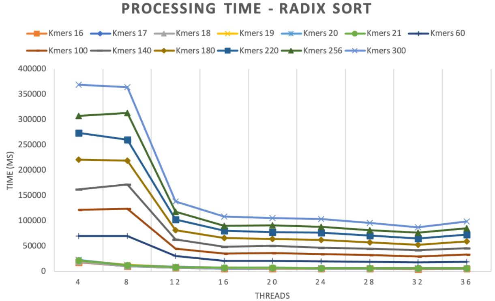
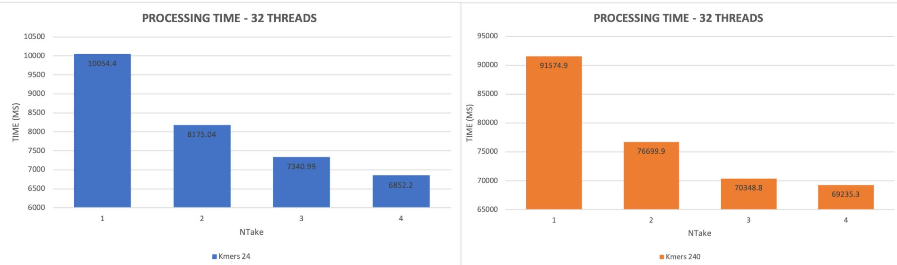

# sexyBWT

## Radixsort
To test: 
1. Make sure [`simdpp`](https://github.com/p12tic/libsimdpp) is in the same folder with `radixsort_test.cpp`.
2. To change numb. of threads: defined as `macro`, in `radixsort.hpp`.
3. Compile by:  `g++ -Ofast -fopenmp radixsort_test.cpp -I ./`
4. Run the program by: `./a.out <dataset_path> <kmers> <n_take> <hist_internal_data_structure>`. 
    E.g, `./a.out ./dataset/drosophila.fa 6 2 vector` 
	Argument description: 
	* `dataset_path`: full path of the dataset (`*.fa`)
	* `kmers`: kmers for sorting
	* `n_take`: how many digits are sorted in each radixsort iteration
	`hist_internal_data_structure`: internal data structure for histogram counting. The options are: `vector` or `array`. Initially, we use `array` due to its faster execution time. However when `n_keys` gets higher, such as in the case of hybrid version with pSAIS, we need `vector` as a replacement. All functions ended 'with' and 'wihtout' `_arr` in `radixsort.hpp` implement `array` and `vector` data structure, respectively. The `vector` version is already tested with `n_keys = 10M`, & with this number, `n_take` can only be 1.

Note: 
* Test case for the correctness of sorting result: run `./a.out ./dataset/20.fa <kmers> 1 <hist_internal_data_structure>`, where `kmers` can be integer of 1 to 5.
* Some exec. time test results are provided below.

